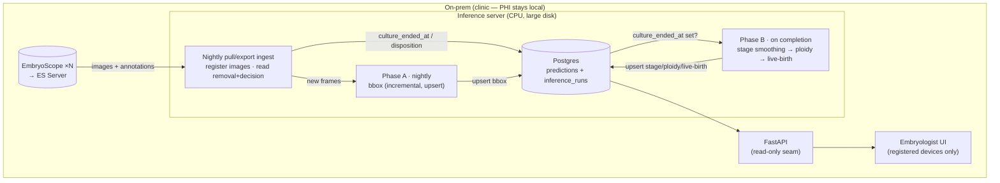

# Continual batch inference — infra plan

**Invariant:** the pipeline's only job is to keep the four prediction tables
(`bbox_`, `timepoint_`, `ploidy_`, `live_birth_predictions`) fresh. The API,
workflow SQL, and frontend never learn where rows came from. Protect this seam.

**Phase 1 is on-prem.** Patient imaging is PHI (HIPAA); keeping capture +
inference in the clinic means PHI never leaves the building — a compliance
advantage, not just a cost one.

## Source: EmbryoScope / ES Server

- Imaging is centralized on the **ES Server** (across incubators), which Vitrolife
builds for "direct integration of AI-based evaluation solutions." We integrate
here, not at the raw incubator.
- Access modes (best → worst): documented DB/API (needs ES Server integration
spec, partner/NDA) → **nightly export** (annotations → Excel/CSV, images →
JPEG) — the export path is public and maps exactly onto a nightly batch.
- Slide insertion is barcode-registered (patient / treatment / slide IDs) → clean
culture *start* and stable join keys. Our seed filenames already use this
format: `D<date>_S<slide>_I<instrument>_P_WELL<n>_RUN<tp>.jpeg`.
- **Action item:** request the ES Server integration spec to pin down read mode
and exact removal/decision field names.

## Prediction DAG & cadence

Mixed granularity + mixed temporal stability drive a tiered schedule:

| Tier                      | Unit                     | When                                   | Why                                                                                                             |
| ------------------------- | ------------------------ | -------------------------------------- | --------------------------------------------------------------------------------------------------------------- |
| **bbox** (Faster-RCNN)    | per timepoint, stateless | **nightly, incremental**               | cheap, spreads CPU load, is the input to the stage crop                                                         |
| **stage** (morphokinetic) | full sequence            | **on culture completion**              | label smoothing re-runs over the *whole* sequence; earlier labels shift as frames arrive — run once, when final |
| **ploidy + live-birth**   | per embryo               | after stage detects blast (`tB`/`tEB`) | needs the blast-stage frames; 1 row/embryo                                                                      |

Not latency-sensitive → CPU is fine; batch overnight.

## Completion trigger

Stage smoothing and embryo-level preds **wait for the whole embryo**, so
detecting "finished" is the crux. Two distinct signals, two uses:

- **Quiescence** (timelapse stops / slide removed) → *gates Phase B compute*:
the sequence is final, safe to smooth.
- **Decision annotation** (transfer / freeze / discard, from EmbryoViewer's
*Compare & Select*) → authoritative clinical disposition + plausible future
training label. May not coincide with removal — don't conflate.

Pitfall: completion **cannot** come from the stage model — `tEmpty` is model
output, and we don't run the model until the embryo is done. It must come from
imaging/annotation metadata upstream.

## Schema deltas

- `embryos`: add `culture_ended_at` (nullable; from quiescence/removal) and
`disposition` enum (`transferred` / `frozen` / `discarded`; from decision
annotation). **Phase B trigger:** `culture_ended_at IS NOT NULL AND no stage rows yet`.
- New `inference_runs` ledger (run_id, model_version, embryo, tp-range, status,
timings) — provenance + failure visibility for an unattended nightly job.
- Writes become **UPSERT** (`ON CONFLICT DO UPDATE`): `model_version` is in the
PK, so reprocessing the same model over more frames updates in place. (Demo's
delete-then-insert ingest is dev-only.)
- The `images` table doubles as the work queue: rows with no matching prediction
= pending. A per-embryo watermark can drive incremental scans.

## Edge cases

- **Blast never detected** (false negative) → embryo never scored. Fallback:
also fire Phase B at culture-end regardless of stage.
- **Model rollout** → new `model_version` coexists with old (PK); backfill is a
separate job from the nightly incremental one.
- **Nightly failure** → must be resumable; upsert + watermark + run ledger give
idempotent restart.

## Architecture

## Phase 2 — AWS (groundwork already in place)

The demo left the migration seams open:

- **Images:** DB stores S3-style logical keys; the API resolves key → disk-or-S3
at request time (`_image_url` / `get_image`). Flipping on-prem disk → S3 is a
one-resolver config change, not a schema migration.
- **DB:** Postgres → RDS Postgres is lift-and-shift.
- **Compute:** nightly CPU batch → EC2/Batch GPU jobs if multi-clinic scale
demands it. Moving compute to cloud adds PHI to the cloud → requires a BAA +
encryption; on-prem-first defers that.

End state: on-prem capture/landing, images replicated to S3, inference + serving
in cloud — or full cloud once compliance is squared away.